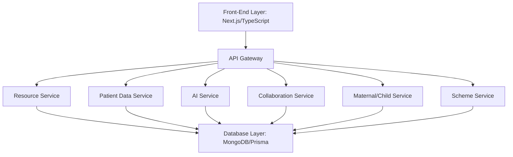

<div align="center">
  
  
  # MedLink
  
  <h3>AI-Powered Hospital Network Management System</h3>

  [](https://nextjs.org/)
  [](https://www.typescriptlang.org/)
  [](https://www.mongodb.com/)
  [](https://tailwindcss.com/)

  <p>Revolutionizing healthcare through AI, connectivity and centralized management.</p>
  
  <a href="https://medlink-captainsza.vercel.app">🌐 View Demo</a> •
  <a href="https://github.com/captainsza/medlink">💻 GitHub</a> •
  <a href="https://github.com/captainsza/medlink/issues">🐛 Report Bug</a>
</div>

---

## 📋 Overview

MedLink tackles pressing healthcare challenges such as inadequate doctor-patient ratios, delayed diagnoses, and limited access to healthcare schemes. Our platform creates a unified network that connects hospitals and healthcare providers to:

- 🏥 Centralize patient data management across facilities
- 📊 Track critical resources in real-time
- 🤖 Leverage AI for faster diagnostics and data retrieval
- 👨‍👩‍👧 Enhance maternal and child healthcare support in underserved areas

<div align="center">
  
</div>

## 🚨 Problem Statement

Healthcare systems worldwide are burdened by:

- **Resource Constraints:** Critical shortages in medical staff and equipment, particularly affecting rural areas
- **Diagnostic Delays:** Inefficient data access leading to treatment delays and poorer patient outcomes 
- **Low Scheme Adoption:** Complex processes limiting enrollment in healthcare insurance and government programs
- **Maternal/Child Health Gaps:** Insufficient support for early identification of high-risk pregnancies and nutritional challenges

## 💡 Solution

MedLink provides a comprehensive approach through:

| Feature | Description |
|---------|-------------|
| **Universal Patient Database** | Secure, centralized repository for patient records with proper access controls |
| **AI-Powered Chatbot** | Leverages Llama 3 to provide immediate information retrieval and clinical decision support |
| **Resource Management** | Real-time tracking and optimization of hospital assets and capacity |
| **Inter-Hospital Collaboration** | Automated alert system for resource sharing during emergencies and shortages |
| **Maternal/Child Health Module** | Specialized tools for frontline workers to identify high-risk cases and provide nutritional guidance |
| **Offline Capabilities** | Local caching ensures functionality in areas with limited connectivity |

## 🌟 Key Features

<div align="center">
  <table>
    <tr>
      <td align="center">
        
        <br />
        <b>Universal Patient Records</b>
      </td>
      <td align="center">
        
        <br />
        <b>AI-Powered Analysis</b>
      </td>
      <td align="center">
        
        <br />
        <b>Resource Tracking</b>
      </td>
    </tr>
    <tr>
      <td align="center">
        
        <br />
        <b>Smart Alerts</b>
      </td>
      <td align="center">
        
        <br />
        <b>Maternal/Child Health</b>
      </td>
      <td align="center">
        
        <br />
        <b>Offline Support</b>
      </td>
    </tr>
  </table>
</div>

## 🔧 Architecture

MedLink employs a microservices architecture for scalability and flexibility:



- **Resource Service:** Tracks hospital resources in real-time
- **Patient Data Service:** Securely manages patient records
- **AI Service:** Powers chatbot and diagnostic features using Llama 3
- **Collaboration Service:** Facilitates inter-hospital communication
- **Maternal/Child Service:** Provides specialized health analytics
- **Scheme Service:** Maps patients to applicable healthcare schemes

## 🛠️ Technology Stack

<div align="center">
  
  
  
  
  
  
</div>

## 📊 Project Status

MedLink is currently in development for the Pragati AI for Impact Hackathon 2025.

<div align="center">
  <table>
    <tr>
      <td><b>Overall Progress:</b></td>
      <td>
        
      </td>
    </tr>
    <tr>
      <td><b>Database Design:</b></td>
      <td>
        
      </td>
    </tr>
    <tr>
      <td><b>UI/UX Design:</b></td>
      <td>
        
      </td>
    </tr>
    <tr>
      <td><b>AI Integration:</b></td>
      <td>
        
      </td>
    </tr>
    <tr>
      <td><b>API Development:</b></td>
      <td>
        
      </td>
    </tr>
  </table>
</div>

## 🚀 Installation and Setup

To set up MedLink locally, follow these steps:

1. **Clone the Repository:**
   ```bash
   git clone https://github.com/captainsza/medlink.git
   cd medlink
   ```

2. **Install Dependencies:**
   ```bash
   npm install
   # or
   yarn install
   ```

3. **Set Environment Variables:**
   Create a `.env.local` file in the root directory:
   ```
   MONGODB_URI=your_mongodb_connection_string
   NEXT_PUBLIC_API_URL=your_api_url
   # Add other environment variables as needed
   ```

4. **Run the Development Server:**
   ```bash
   npm run dev
   # or
   yarn dev
   ```

5. **View the Application:**
   Open [http://localhost:3000](http://localhost:3000) in your browser.

## 👥 Team

MedLink is being developed by Team QUBITRULES:

<table>
  <tr>
    <td align="center">
      <a href="https://github.com/captainsza">
        
        <br />
        <sub><b>Zaid Ahmad</b></sub>
      </a>
      <br />
      <sub>Team Lead</sub>
    </td>
    <td align="center">
      <a href="https://github.com/captainsza">
        
        <br />
        <sub><b>Ayan Ahmad</b></sub>
      </a>
      <br />
      <sub>Developer</sub>
    </td>
    <td align="center">
      <a href="https://github.com/captainsza">
        
        <br />
        <sub><b>Ashish</b></sub>
      </a>
      <br />
      <sub>Developer</sub>
    </td>
  </tr>
</table>

## 🤝 Contributing

We welcome contributions to MedLink! Here's how you can help:

1. Fork the repository
2. Create your feature branch (`git checkout -b feature/amazing-feature`)
3. Commit your changes (`git commit -m 'Add some amazing feature'`)
4. Push to the branch (`git push origin feature/amazing-feature`)
5. Open a Pull Request

Please read our [Contributing Guidelines](CONTRIBUTING.md) for more details.

## 📜 License

This project is licensed under the MIT License - see the [LICENSE](LICENSE) file for details.

## 📬 Contact

For any inquiries about MedLink, please reach out to:

- **Zaid Ahmad** - Team Lead - [GitHub](https://github.com/captainsza)

---

<div align="center">
  <a href="https://medlink-captainsza.vercel.app">
    
  </a>
  <p>Made with ❤️ for better healthcare</p>
</div>
